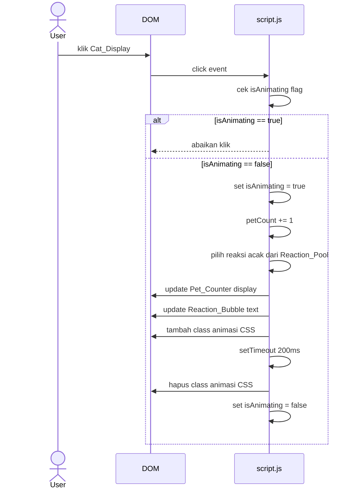

# Design Document: Cat Clicker Game

## Overview

Cat Clicker Game adalah aplikasi web single-page yang berjalan sepenuhnya di browser tanpa backend. Pengguna dapat mengklik ilustrasi SVG kucing minimalis untuk menambah pet counter dan memicu reaksi teks acak dari kucing. Aplikasi menggunakan tiga file statis (`index.html`, `style.css`, `script.js`) dan tidak memerlukan proses build, server, atau instalasi apapun.

### Pendekatan Teknis

- **HTML5** untuk struktur halaman dan elemen semantik
- **Tailwind CSS via CDN** untuk utilitas styling
- **Vanilla JavaScript** untuk logika game dan manipulasi DOM
- **Inline SVG** untuk ilustrasi kucing minimalis
- State disimpan sepenuhnya dalam memori JavaScript (dua variabel: `petCount` dan `currentReaction`)

---

## Architecture

Aplikasi memiliki arsitektur tiga lapis yang sederhana:

```
┌─────────────────────────────────────────┐
│              index.html                 │
│  (struktur HTML + referensi ke assets)  │
└───────────┬───────────────┬─────────────┘
            │               │
     ┌──────▼──────┐  ┌──────▼──────┐
     │  style.css  │  │  script.js  │
     │  (visual +  │  │  (state +   │
     │  animasi)   │  │  logika)    │
     └─────────────┘  └─────────────┘
```

**Aliran data:**
1. User klik Cat_Display → event handler di `script.js` dipanggil
2. Logika memeriksa apakah animasi sedang berjalan (lock)
3. Jika tidak terkunci: increment counter, pilih reaksi acak, trigger animasi
4. DOM diperbarui: tampilkan counter baru dan teks reaksi baru
5. Setelah animasi selesai (200ms): lepas lock



---

## Components and Interfaces

### 1. Cat_Display

Ilustrasi SVG kucing minimalis yang di-embed langsung di HTML. Dapat diklik oleh user.

```html
<!-- Struktur SVG kucing minimalis (contoh) -->
<div id="cat-display" class="cat-container cursor-pointer select-none">
  <svg viewBox="0 0 120 120" xmlns="http://www.w3.org/2000/svg">
    <!-- telinga kiri -->
    <polygon points="20,50 35,20 50,50" fill="#f5a623"/>
    <!-- telinga kanan -->
    <polygon points="70,50 85,20 100,50" fill="#f5a623"/>
    <!-- kepala -->
    <circle cx="60" cy="65" r="40" fill="#f5a623"/>
    <!-- wajah (mata, hidung, kumis, mulut) -->
    <!-- ... elemen SVG tambahan ... -->
  </svg>
</div>
```

**Atribut/State:**
- `isAnimating: boolean` — flag untuk mencegah klik ganda selama animasi

**Event:**
- `click` → trigger handler `handleCatClick()`

### 2. Pet_Counter

Elemen HTML yang menampilkan nilai counter saat ini.

```html
<div id="pet-counter">
  <span id="counter-value">0</span>
</div>
```

**State:**
- `petCount: number` (integer ≥ 0, tersimpan di memori JS)

### 3. Reaction_Bubble

Elemen bubble teks yang menampilkan reaksi kucing.

```html
<div id="reaction-bubble">
  <span id="reaction-text">Halo! Yuk elus aku!</span>
</div>
```

**State:**
- `currentReaction: string` (string dari Reaction_Pool atau Initial_Message)

### 4. Reset_Button

Tombol yang me-reset seluruh state game ke kondisi awal.

```html
<button id="reset-btn" onclick="handleReset()">Reset</button>
```

**Event:**
- `click` → trigger handler `handleReset()`

### 5. JavaScript Interface (script.js)

```javascript
// State
let petCount = 0;
let isAnimating = false;

// Konstanta
const INITIAL_MESSAGE = "Halo! Yuk elus aku!";
const REACTION_POOL = ["Meow~", "Purrr...", "Nyan~", "Aku senang!", "Lagi dong!", "😺"];
const ANIMATION_DURATION = 200; // ms

// Fungsi utama
function handleCatClick()   // dipanggil saat Cat_Display diklik
function handleReset()      // dipanggil saat Reset_Button diklik
function getRandomReaction() // mengembalikan string acak dari REACTION_POOL
function updateDisplay()    // memperbarui DOM berdasarkan state saat ini
function playAnimation()    // menjalankan Click_Animation dan mengelola lock
```

---

## Data Models

### Game State

State game disimpan sepenuhnya dalam dua variabel JavaScript di memori:

```javascript
// State utama
let petCount = 0;          // integer non-negatif, jumlah klik sejak halaman dimuat
let isAnimating = false;   // boolean, true ketika Click_Animation sedang berjalan

// Konstanta (bukan state, tidak berubah)
const INITIAL_MESSAGE = "Halo! Yuk elus aku!";
const REACTION_POOL = [
  "Meow~",
  "Purrr...",
  "Nyan~",
  "Aku senang!",
  "Lagi dong!",
  "😺"
];
```

**Invariant state:**
- `petCount` selalu berupa integer ≥ 0
- `petCount` hanya bertambah 1 per klik yang valid (saat `isAnimating == false`)
- `isAnimating` kembali ke `false` tepat setelah 200ms dari klik yang valid
- Tidak ada state yang disimpan di luar memori JS (tidak ada localStorage, cookie, dll.)

### DOM State (turunan dari Game State)

| Elemen DOM | Nilai yang ditampilkan | Sumber |
|---|---|---|
| `#counter-value` | `petCount.toString()` | Variabel `petCount` |
| `#reaction-text` | String reaksi saat ini | `REACTION_POOL[random]` atau `INITIAL_MESSAGE` |
| `#cat-display` | Class CSS animasi | Variabel `isAnimating` |

---

## Correctness Properties

*A property is a characteristic or behavior that should hold true across all valid executions of a system — essentially, a formal statement about what the system should do. Properties serve as the bridge between human-readable specifications and machine-verifiable correctness guarantees.*

### Property 1: Counter increment exactness

*For any* current pet counter value `n` (n ≥ 0), when a valid click occurs on Cat_Display (i.e., `isAnimating` is false), the resulting counter value SHALL be exactly `n + 1`.

**Validates: Requirements 3.1, 1.4**

---

### Property 2: Reaction always from pool

*For any* click on Cat_Display, the text displayed in Reaction_Bubble SHALL always be one of the 6 strings in the Reaction_Pool: `["Meow~", "Purrr...", "Nyan~", "Aku senang!", "Lagi dong!", "😺"]`.

**Validates: Requirements 3.3**

---

### Property 3: Uniform reaction distribution

*For any* sufficiently large sequence of N clicks (N ≥ 600), each of the 6 reactions in Reaction_Pool SHALL appear with a frequency approximately equal to N/6 (within a statistical tolerance), confirming the selection uses a uniform distribution.

**Validates: Requirements 3.4**

---

### Property 4: Reset restores initial state

*For any* game state (any value of `petCount` ≥ 0 and any currently displayed reaction), clicking Reset_Button SHALL result in `petCount` becoming exactly 0 AND Reaction_Bubble displaying exactly `"Halo! Yuk elus aku!"`.

**Validates: Requirements 4.1, 4.2**

---

### Property 5: Reset is idempotent

*For any* game state that is already the initial state (`petCount == 0` and reaction displaying `"Halo! Yuk elus aku!"`), clicking Reset_Button SHALL produce the same initial state — the state is unchanged.

**Validates: Requirements 4.4**

---

### Property 6: Animation lock prevents double-counting

*For any* sequence of rapid clicks where subsequent clicks arrive within the 200ms animation window of a prior click, only the first click in that window SHALL increment the counter. The counter SHALL increment by exactly 1 regardless of how many clicks occur during an active animation.

**Validates: Requirements 3.5**

---

## Error Handling

Karena aplikasi ini berjalan sepenuhnya di browser tanpa backend atau I/O eksternal, potensi error sangat terbatas. Berikut skenario yang perlu ditangani:

### 1. Klik selama animasi (Click Lock)

**Skenario:** User mengklik Cat_Display lebih dari sekali dalam 200ms.

**Penanganan:** Flag `isAnimating` diset ke `true` saat animasi dimulai dan dikembalikan ke `false` setelah 200ms melalui `setTimeout`. Semua klik yang masuk saat `isAnimating == true` langsung di-return tanpa efek apapun.

```javascript
function handleCatClick() {
  if (isAnimating) return; // abaikan klik
  isAnimating = true;
  // ... logika klik
  setTimeout(() => { isAnimating = false; }, ANIMATION_DURATION);
}
```

### 2. Reset saat kondisi awal

**Skenario:** User mengklik Reset saat `petCount` sudah 0 dan reaksi sudah `Initial_Message`.

**Penanganan:** Handler `handleReset()` selalu menjalankan operasi reset penuh (set `petCount = 0`, set reaksi ke `INITIAL_MESSAGE`, update DOM). Tidak diperlukan pengecekan kondisi khusus karena hasilnya identik dengan kondisi awal — operasi ini idempoten.

### 3. Tailwind CSS CDN gagal dimuat

**Skenario:** Koneksi internet tidak tersedia sehingga Tailwind CDN script tidak bisa diunduh.

**Penanganan:** Styling kustom esensial (layout, warna, animasi) didefinisikan di `style.css` sebagai fallback. Tailwind hanya digunakan untuk utilitas tambahan, sehingga layout utama tetap fungsional tanpa Tailwind.

### 4. Browser tidak mendukung CSS Transition

**Skenario:** Browser sangat lama yang tidak mendukung CSS `transition` atau `transform`.

**Penanganan:** Fungsionalitas inti (counter increment, reaksi) tetap bekerja. Animasi hanya sebagai enhancement visual — tidak ada logika yang bergantung pada animasi untuk berfungsi.

---

## Testing Strategy

### Dual Testing Approach

Strategi pengujian menggunakan dua pendekatan komplementer:
1. **Unit/Example Tests** — menguji behavior spesifik dengan contoh konkret
2. **Property-Based Tests** — menguji properti universal di seluruh input yang mungkin

### Property-Based Testing

Fitur ini mengandung logika JavaScript murni (counter increment, random selection, state reset) yang cocok untuk property-based testing. Library yang digunakan: **[fast-check](https://fast-check.dev/)** untuk JavaScript.

Setiap property test harus:
- Dijalankan minimal **100 iterasi** per property
- Diberi komentar tag referensi ke dokumen desain: `// Feature: cat-clicker-game, Property N: <teks properti>`

#### Property Tests

**Property 1 — Counter increment exactness**
```
// Feature: cat-clicker-game, Property 1: Counter increment exactness
// Untuk sembarang nilai counter n >= 0, klik valid menghasilkan n+1
fc.assert(
  fc.property(fc.nat(), (n) => {
    const state = createGameState(n);
    handleCatClick(state);
    return state.petCount === n + 1;
  }),
  { numRuns: 100 }
);
```

**Property 2 — Reaction always from pool**
```
// Feature: cat-clicker-game, Property 2: Reaction always from pool
// Untuk sembarang klik, reaksi yang ditampilkan selalu dari REACTION_POOL
fc.assert(
  fc.property(fc.nat(), (_seed) => {
    const state = createGameState(0);
    handleCatClick(state);
    return REACTION_POOL.includes(state.currentReaction);
  }),
  { numRuns: 100 }
);
```

**Property 3 — Uniform reaction distribution**
```
// Feature: cat-clicker-game, Property 3: Uniform reaction distribution
// Setelah 600 klik, setiap reaksi muncul setidaknya sekali
fc.assert(
  fc.property(fc.constant(null), () => {
    const counts = {};
    REACTION_POOL.forEach(r => counts[r] = 0);
    for (let i = 0; i < 600; i++) {
      const reaction = getRandomReaction();
      counts[reaction]++;
    }
    return REACTION_POOL.every(r => counts[r] > 0);
  }),
  { numRuns: 100 }
);
```

**Property 4 — Reset restores initial state**
```
// Feature: cat-clicker-game, Property 4: Reset restores initial state
// Untuk sembarang state, reset selalu menghasilkan state awal
fc.assert(
  fc.property(fc.nat(), fc.constantFrom(...REACTION_POOL), (n, reaction) => {
    const state = createGameState(n, reaction);
    handleReset(state);
    return state.petCount === 0 && state.currentReaction === INITIAL_MESSAGE;
  }),
  { numRuns: 100 }
);
```

**Property 5 — Reset is idempotent**
```
// Feature: cat-clicker-game, Property 5: Reset is idempotent
// Reset pada state awal tidak mengubah apapun
fc.assert(
  fc.property(fc.constant(null), () => {
    const state = createGameState(0, INITIAL_MESSAGE);
    handleReset(state);
    handleReset(state);
    return state.petCount === 0 && state.currentReaction === INITIAL_MESSAGE;
  }),
  { numRuns: 100 }
);
```

**Property 6 — Animation lock prevents double-counting**
```
// Feature: cat-clicker-game, Property 6: Animation lock prevents double-counting
// Klik ganda selama animasi hanya menghasilkan increment 1 kali
fc.assert(
  fc.property(fc.nat(), fc.integer({ min: 2, max: 20 }), (n, extraClicks) => {
    const state = createGameState(n);
    // simulasi klik berturutan tanpa menunggu animasi selesai
    for (let i = 0; i <= extraClicks; i++) {
      handleCatClick(state); // klik pertama valid, sisanya terkunci
    }
    return state.petCount === n + 1;
  }),
  { numRuns: 100 }
);
```

### Unit / Example Tests

Test berbasis contoh untuk behavior spesifik yang tidak cocok untuk property testing:

| Test | Deskripsi | Expected |
|---|---|---|
| Initial state | Halaman pertama kali dimuat | `petCount = 0`, reaction = "Halo! Yuk elus aku!" |
| Cat_Display visible | SVG elemen ada di DOM | `document.getElementById('cat-display')` tidak null |
| Pet_Counter visible | Counter elemen ada di DOM | `document.getElementById('counter-value')` tidak null |
| Reset_Button visible | Tombol reset ada di DOM | `document.getElementById('reset-btn')` tidak null |
| Tailwind CDN tag | `<script>` CDN Tailwind ada di `<head>` | `<script src="https://cdn.tailwindcss.com">` ada |
| No localStorage usage | `script.js` tidak menggunakan localStorage | Grep `localStorage` di `script.js` = 0 hasil |
| No external JS lib | `script.js` tidak import library eksternal | Tidak ada `import`/`require` di `script.js` |
| Animation class added | Saat klik, class animasi ditambahkan ke Cat_Display | Class CSS animasi ada selama 200ms |
| Animation class removed | Setelah 200ms, class animasi dihapus | Class CSS animasi tidak ada setelah animasi selesai |
| Mobile layout max-width | Pada viewport < 768px, lebar konten ≤ 480px | CSS max-width: 480px aktif |

### Testing Tools yang Disarankan

- **Property-based testing:** [fast-check](https://fast-check.dev/) — library PBT untuk JavaScript/TypeScript
- **Unit testing:** [Vitest](https://vitest.dev/) atau [Jest](https://jestjs.io/) — keduanya mendukung ES modules
- **DOM testing:** [jsdom](https://github.com/jsdom/jsdom) (built-in di Vitest) untuk simulasi DOM di Node.js
- **Note:** Fungsi logika murni (`getRandomReaction`, `handleCatClick`, `handleReset`) harus dapat diuji tanpa browser — pisahkan dari kode DOM manipulation.

### Catatan Refactoring untuk Testability

Agar logika game dapat diuji tanpa browser (tanpa `document`, `window`), fungsi-fungsi kunci di `script.js` sebaiknya mengekspos pure functions yang dapat diimpor:

```javascript
// Contoh desain yang testable
export function createGameState(petCount = 0, reaction = INITIAL_MESSAGE) {
  return { petCount, currentReaction: reaction, isAnimating: false };
}

export function getRandomReaction() {
  return REACTION_POOL[Math.floor(Math.random() * REACTION_POOL.length)];
}

export function handleCatClick(state) {
  if (state.isAnimating) return;
  state.petCount += 1;
  state.currentReaction = getRandomReaction();
  // animasi dan DOM update dilakukan terpisah
}

export function handleReset(state) {
  state.petCount = 0;
  state.currentReaction = INITIAL_MESSAGE;
  state.isAnimating = false;
}
```
